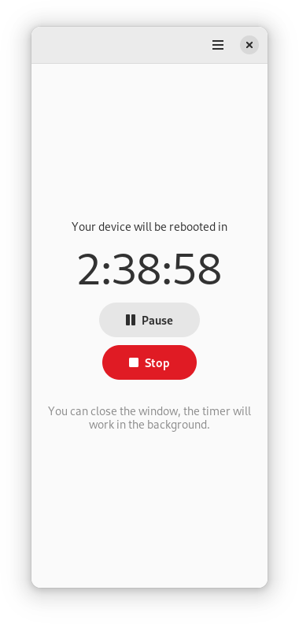

# Time Switch

 
 

Power off, reboot, suspend, send a notification or execute any command on timer.

**Time Switch** is a simple program that allows you to power off, reboot or suspend your system, send a notification (optionally with a sound signal) or execute any command on timer.
The app is built for GNOME and uses LibAdwaita, but it works in any desktop environment.
