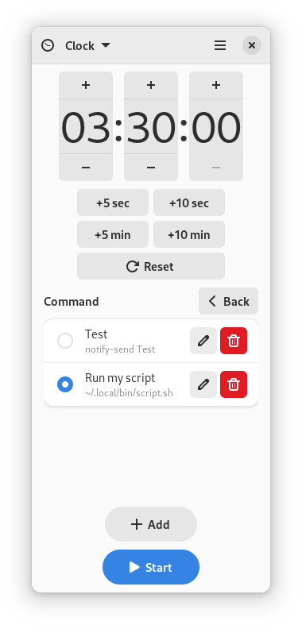

<h1>Time Switch</h1>

Run tasks after a timer

 

 

**Time Switch** is an easy to use program that allows you to power off, reboot or suspend your system, send a notification (optionally with a sound signal) or execute any command on timer. The app is built for GNOME and uses LibAdwaita, but it works in any desktop environment.

## Building

The easiest way to build the development version of Time Switch is by using GNOME Builder as described [here](https://wiki.gnome.org/Newcomers/BuildProject).

## Translations

The app is being translated using Weblate (click the image above to join).

In case you don't want to use Weblate, follow this [instruction](po/README.md).

## Code of Conduct

This project follows the [GNOME Code of Conduct](https://wiki.gnome.org/Foundation/CodeOfConduct).
